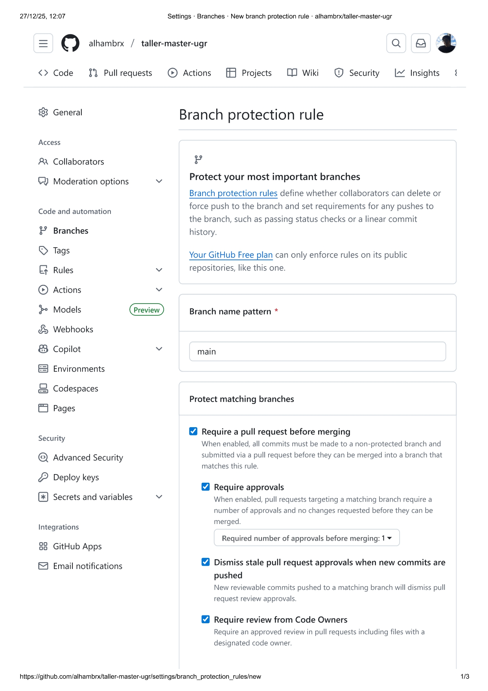
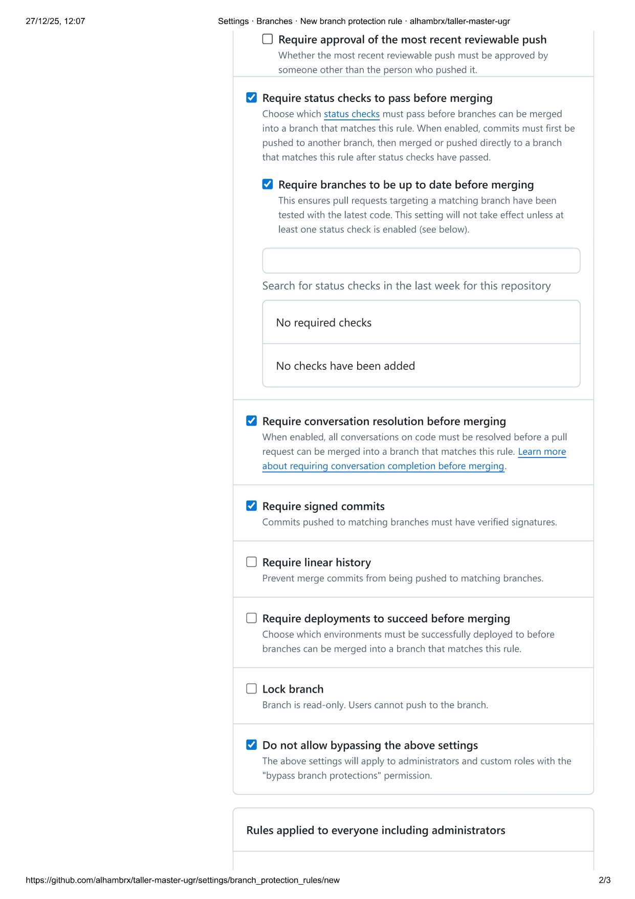
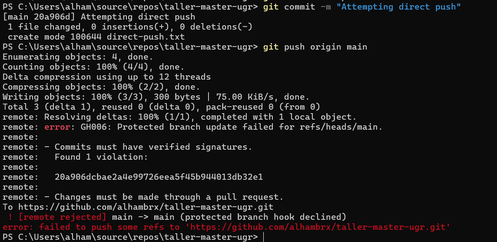
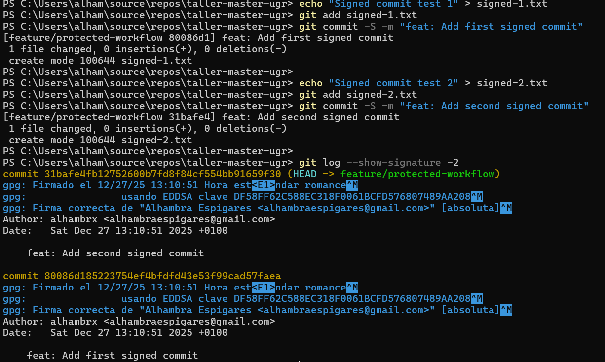
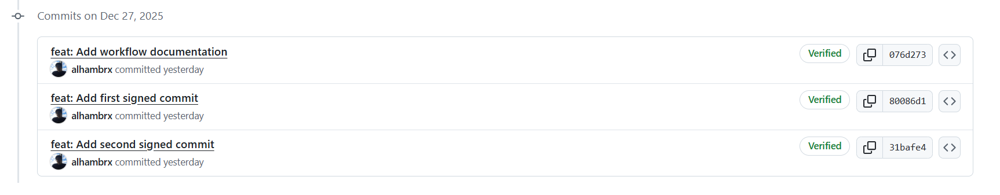
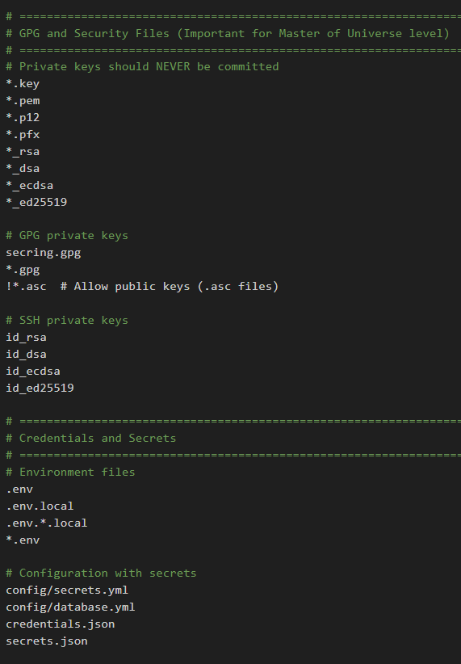
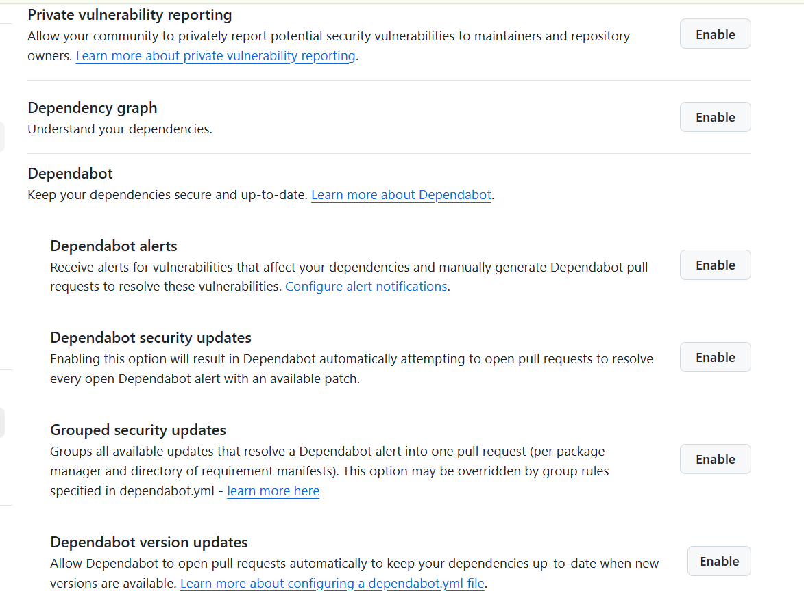

# Exercise Outcomes Submission Template

**Student/Group Name**: Alhambra Espigares 
**Level Completed**: master-of-the-universe
**Date**: 28-12-2025

---

## 📋 Exercise Summary

### Exercise: Level master of the universe
**Status**: ✅ Completed 

**What I did**:
Realicé la configuración de protección de ramas en GitHub, creé PRs siguiendo la política de protección, generé claves GPG para commits firmados, revisé la gestión de datos sensibles y realicé un mini-audit de seguridad del repositorio.  

**Commands Used**:
```bash
# Branches & workflow
git checkout master-of-the-universe
git checkout -b feature/protected-workflow
git add workflow.txt
git commit -S -m "feat: Add workflow documentation"
git push origin feature/protected-workflow

# GPG setup
gpg --full-generate-key
gpg --list-secret-keys --keyid-format=long
git config --global user.signingkey DF58FF62C588EC318F0061BCFD576807489AA208
git config --global commit.gpgsign true

# Sensitive data scans
git log -p | findstr /i "password api_key secret token"
git rev-list --objects --all | git cat-file --batch-check="%(objecttype) %(objectname) %(objectsize) %(rest)"
```

**Results/Output**:
```bash
# Signed commits
commit 31bafe4fb12752600b7fd8f84cf554bb91659f30 (HEAD -> feature/protected-workflow, origin/feature/protected-workflow)
gpg: Firmado el 12/27/25 13:10:51 Hora est<E1>ndar romance^M
gpg:                usando EDDSA clave DF58FF62C588EC318F0061BCFD576807489AA208^M
gpg: Firma correcta de "Alhambra Espigares <alhambraespigares@gmail.com>" [absoluta]^M
Author: alhambrx <alhambraespigares@gmail.com>
Date:   Sat Dec 27 13:10:51 2025 +0100

    feat: Add second signed commit

commit 80086d185223754ef4bfdfd43e53f99cad57faea
gpg: Firmado el 12/27/25 13:10:51 Hora est<E1>ndar romance^M
gpg:                usando EDDSA clave DF58FF62C588EC318F0061BCFD576807489AA208^M
gpg: Firma correcta de "Alhambra Espigares <alhambraespigares@gmail.com>" [absoluta]^M
Author: alhambrx <alhambraespigares@gmail.com>
Date:   Sat Dec 27 13:10:51 2025 +0100
```

**Screenshots**  
-   
  Captura de la configuración de branch protection para la rama `main`, mostrando todas las reglas activas (PR obligatorio, revisiones, commits firmados, status checks, etc.).
-   
  Otra vista de la configuración de branch protection para `main`, enfocando los ajustes de revisiones y aprobaciones.
-  - Evidencia de que el push directo a `main` fue bloqueado por las protecciones de rama.  
-  - Muestra commits firmados correctamente en la terminal (`git log --show-signature`).  
-  - Captura de GitHub mostrando que los commits tienen esta etiqueta.  
-  - Evidencia de que `.gitignore` cubre archivos sensibles y evita que sean versionados.  
-  - Configuración de seguridad de GitHub (Dependabot alerts, security updates, code scanning, etc.).

---

## 🎯 Key Learnings

**Main concepts I learned**:

1. Cómo configurar reglas de protección de ramas en GitHub y entender su impacto en el flujo de trabajo.
2. Cómo generar y usar claves GPG para firmar commits y garantizar verificación en GitHub.
3. Prácticas seguras de gestión de datos sensibles y revisión de historial para detectar secretos.

**Skills I improved**:

* Uso avanzado de Git: creación de ramas, pull requests, y gestión de flujos protegidos.
* Firma y verificación de commits con GPG, incluyendo resolución de errores comunes en Windows.
* Auditoría de repositorios: revisión de `.gitignore`, búsqueda de patrones de secretos, y comprensión de herramientas como `git-filter-repo` o BFG para remediación.

---

## 🚧 Challenges Faced

### Challenge 1: Configuración de commit firmado con GPG

**Problem**:
Al intentar hacer commits firmados (`git commit -S`) en la rama `feature/protected-workflow`, Git fallaba con el error: `gpg: signing failed: No secret key`. Además, al listar claves con `gpg --list-secret-keys` dentro del repositorio parecía que no existía ninguna clave, aunque sí estaba instalada en la ruta del usuario.

**Solution**:

* Verifiqué que GPG estaba correctamente instalado en el sistema (`gpg --version`).
* Generé una nueva clave GPG (`gpg --full-generate-key`) asociada al correo usado en GitHub.
* Configuré Git globalmente para usar la clave correcta:

```bash
git config --global user.signingkey clave
git config --global commit.gpgsign true
```

* Ahora los commits se firman correctamente y aparecen como Verified en GitHub.

**Commands/Approach**:

```bash
gpg --full-generate-key
gpg --list-secret-keys --keyid-format=long
git config --global user.signingkey DF58FF62C588EC318F0061BCFD576807489AA208
git config --global commit.gpgsign true
git commit -S -m "feat: Add signed commit"
```

### Challenge 2: Protección de ramas y flujo de trabajo

**Problem**:
Intenté hacer un push directo a `main` después de configurar branch protection, y fue bloqueado. Esto generó confusión sobre cómo debía trabajar con las ramas y PR.

**Solution**:

* Aprendí a crear ramas de características (`feature branch`) desde `master-of-the-universe` en lugar de `main`.
* Realicé commits en la nueva rama protegida, los firmé con GPG y luego creé Pull Requests en GitHub para `main`.

**Commands/Approach**:

```bash
git checkout master-of-the-universe
git checkout -b feature/protected-workflow
git add workflow.txt
git commit -S -m "feat: Add workflow documentation"
git push origin feature/protected-workflow
```

---

## 💭 Personal Reflection

**What surprised me**:
Me sorprendió lo complejo que puede ser configurar correctamente commits firmados con GPG y cómo pequeñas diferencias de correo o claves pueden bloquear todo el flujo de trabajo. También descubrí cómo GitHub automatiza las revisiones de los Code Owners y bloquea pushes directos cuando las protecciones están activadas.

**What I found most difficult**:
La parte más difñicil fue la integración de GPG en Windows y asegurar que todos los commits estuvieran verificados. Inicialmente Git no encontraba la clave correcta y tuve que aprender a generar y configurar la clave, exportarla a GitHub y verificar que todo funcionara.

**What I found most useful**:
Aprender a manejar branch protection y flujos de trabajo profesionales. Saber que los commits pueden estar firmados, y que los PR se bloquean hasta cumplir con todas las reglas.

**How I would apply this in real projects**:
En proyectos profesionales, aplicaría estas prácticas para proteger ramas críticas (`main` o `release`) y asegurar que todos los cambios estén revisados y verificados.

---

## 📊 Self-Assessment

| Topic               | Confidence (1-5) | Notes                                                                  |
| ------------------- | ---------------- | ---------------------------------------------------------------------- |
| Basic Git commands  | 5                | Uso diario de add, commit, push, pull                                  |
| Branching & merging | 5                | Manejo de ramas y merges con PR                                        |
| Remote operations   | 5                | Configuración de remotes, push, pull, tracking branches                |
| Conflict resolution | 4                | Me siento cómoda usando merge conflicts y rebase                       |
| History rewriting   | 4                | Conocimiento de git-filter-repo/BFG y reescritura de commits           |
| Git hooks           | 3                | Básico, revisión .gitignore para seguridad             |
| Security practices  | 3                | Implementación de GPG, branch protection, revisión de secretos, aunque necesitaría practicar más para terminar de controlarlo         |

---

## 🔗 Evidence/Artifacts

**Links to branches/commits**:
- Link to your outcome branch: `https://github.com/alhambrx/taller-master-ugr/tree/alh-outcomes/master-of-the-universe`
- Key commits demonstrating your work:
  - 31bafe4: feat: Add second signed commit
  - 80086d1: feat: Add first signed commit
  - 076d273: feat: Add workflow documentation

**Additional files created** 
- signed-1 y signed-2
- workflow

---

## ✅ Completion Checklist

Before submitting, ensure you have:
- [x] Completed the exercise for your chosen level (including all parts)
- [x] Documented all commands used with their outputs
- [x] Described challenges and how you resolved them
- [x] Provided a thoughtful reflection on your learning
- [x] Self-assessed your confidence in each topic
- [x] Pushed your outcome branch to the remote repository
- [ ] Created a Pull Request (if required by your instructor)

---

## 📝 Completando los requerimientos del ejercicio

---

### Part 1 - Branch Protection Rules

**Objetivo:** Implementar reglas de protección de ramas para asegurar la integridad del código en `main` y prevenir cambios no revisados o no verificados.

* **Explanation of each protection rule and its purpose**

  1. **Require pull request before merging:** Obliga a que todos los cambios pasen por un PR, evitando pushes directos.
  2. **Require approvals (at least 1):** Cada PR debe ser revisado y aprobado por al menos un revisor, asegurando control de calidad.
  3. **Dismiss stale pull request approvals:** Si se añaden nuevos commits al PR, se invalidan aprobaciones anteriores para garantizar que revisores validen los cambios recientes.
  4. **Require review from CODEOWNERS:** Los usuarios indicados en el archivo `CODEOWNERS` son solicitados automáticamente para revisar PRs en áreas críticas.
  5. **Require status checks to pass before merging:** Integración continua o tests automatizados deben pasar para aprobar un merge, evitando código roto.
  6. **Require branches to be up to date before merging:** Evita merges con base desactualizada que puedan introducir conflictos o problemas.
  7. **Require conversation resolution:** Todos los comentarios críticos en PR deben resolverse antes de permitir merge.
  8. **Require signed commits:** Garantiza que los commits provengan de usuarios verificados mediante GPG, previniendo suplantaciones de identidad.
  9. **Include administrators:** Las reglas se aplican también a administradores para mantener uniformidad de seguridad.

* **Documentation referencing the CODEOWNERS file**
  `CODEOWNERS` permite asignar automáticamente revisores responsables de directorios o archivos específicos. Esto asegura que cambios en áreas críticas siempre sean revisados por los responsables.

* **Discussion of security vs. workflow balance**
  Las protecciones aumentan la seguridad pero agregan pasos extra al flujo de trabajo. Se debe equilibrar para que los desarrolladores puedan trabajar de manera ágil sin comprometer la integridad del código.

---

### Part 2 - Protected Workflow Testing

**Objetivo:** Verificar que las reglas de protección funcionan y que el flujo de trabajo seguro (PR) es obligatorio.

* **Feature branch PR workflow documentation**
  1. Crear branch de feature desde `main` o `master-of-the-universe`.
  2. Hacer commits firmados con GPG.
  3. Hacer push al remoto.
  4. Abrir PR y solicitar revisiones.

* **Understanding of code owner review process**
  Los CODEOWNERS reciben notificaciones automáticas para revisar PRs, y esto mejora la calidad del código y la seguridad en áreas críticas.

---

### Part 3 - GPG Signing Setup

**Objetivo:** Configurar GPG para firmar commits y asegurar su autenticidad.

* **Git configuration commands used**

  ```bash
  git config --global user.signingkey DF58FF62C588EC318F0061BCFD576807489AA208
  git config --global commit.gpgsign true
  ```

**Beneficio:** Permite verificar la identidad de los autores, previniendo commits fraudulentos y aumentando la confianza en el historial del repositorio.

---

### Part 4 - Sensitive Data Management

**Objetivo:** Asegurar que datos sensibles nunca se comprometan y enseñar buenas prácticas de manejo de secretos.

* **Review of .gitignore file ensuring comprehensive coverage**
  Hemos revisado que `.gitignore` cubre `.env`, archivos de configuración con secretos, llaves privadas, logs, backups, etc.

* **Repository history scan for sensitive patterns (output)**
Ejemplo:

  ```bash
  git log -p | findstr /i "password api_key secret token"
  ```

* **Documentation of remediation approaches (process understanding)**
  Entendemos **cómo eliminar secretos históricos** de la historia de Git en caso de haberlos cometido accidentalmente. Herramientas comunes incluyen:

  * `git-filter-repo`: Permite reescribir la historia eliminando archivos o patrones específicos de todos los commits.
  * `BFG Repo-Cleaner`: Una alternativa rápida y segura para eliminar archivos grandes o sensibles del historial.

* **Understanding of when to rotate credentials**
  Incluso después de eliminar los secretos de la historia, **es obligatorio rotar las credenciales comprometidas** (API keys, contraseñas, certificados) si alguna vez se subieron a un repositorio público o compartido. Esto garantiza que cualquier copia previa del secreto quede inutilizable y mantiene la seguridad del sistema.

**Beneficio:** Prevenir filtraciones de información sensible y mantener la seguridad del proyecto en repositorios compartidos.

---

### Part 5 - Security Audit and Best Practices

**Objetivo:** Evaluar el estado de seguridad del repositorio y documentar prácticas recomendadas.

* **Security audit findings from your repository**
  Buscamos  vulnerabilidades, commits no firmados previos, secretos potenciales encontrados, etc.

* **Best practices documentation**

  * **GPG signing:** previene suplantación y asegura cadena de confianza.
  * **Branch protection:** evita merges no revisados y protege áreas críticas.
  * **Secret management:** uso de variables de entorno, vaults y pre-commit hooks para evitar subir secretos.

* **Security-focused challenges**

  1. Problemas de configuración de GPG en distintos sistemas operativos.
  2. Dificultad para firmar commits desde IDE/editor.
  3. Balance entre seguridad y productividad en branch protection.
  4. Identificación de secretos en repositorios existentes.
  5. Mantener agilidad en el flujo de trabajo sin comprometer seguridad.

---

## 🔒 Security-Focused Challenges

### 1. **GPG configuration issues across OS/platforms**

**Challenge:** Configurar GPG.
**Impact:** Si GPG no está correctamente configurado, los commits no se firman, y los badges Verified no aparecen en GitHub.
**Resolution/Best Practice:**

* Verificar el PATH y la versión de GPG (`gpg --version`).
* Asociar correctamente la clave con el email usado en GitHub.
* Probar la firma de commits en la terminal antes de usar IDEs o scripts.

---

### 2. **Difficulties with commit signing in IDE/editor**

**Challenge:** Algunos IDEs no usan la misma configuración de Git que la terminal. Por ejemplo, Visual Studio Code necesita que Git esté correctamente configurado y que el agente GPG pueda acceder a la clave.
**Impact:** Commits firmados desde el IDE pueden fallar o no mostrarse como Verified.
**Resolution/Best Practice:**

* Configurar globalmente `user.signingkey` y `commit.gpgsign true`.
* En VS Code, habilitar “Git: Enable Commit Signing”.
* Siempre probar `git log --show-signature` para validar.

---

### 3. **Understanding branch protection trade-offs**

**Challenge:** Las reglas de protección de ramas (PR obligatorio, status checks, revisiones, commits firmados) aumentan la seguridad pero pueden ralentizar el flujo de trabajo, especialmente en equipos pequeños o emergencias.
**Impact:** Push directo bloqueado, tiempo extra en PRs, dependencias de aprobaciones de Code Owners.
**Resolution/Best Practice**
 Balancear seguridad vs. productividad: aplicar reglas estrictas solo en ramas críticas (ej. `main` o `master`).
---

### 4. **Challenges scanning for sensitive patterns**

**Challenge:** Revisar historial de Git para detectar secretos (contraseñas, tokens, claves) puede ser tedioso. Herramientas como `git log -p | grep ...`, `git rev-list --objects --all`, `BFG Repo-Cleaner` o `git-filter-repo` son necesarias.
**Impact:** Riesgo de que datos sensibles se filtren en el repositorio.
**Resolution/Best Practice:**

* Configurar `.gitignore` completo para prevenir commits accidentales de archivos sensibles.

---

### 5. **Balancing security with developer productivity**

**Challenge:** Las medidas de seguridad estrictas pueden generar fricción: PRs más largas, revisiones obligatorias, commits firmados, etc.
**Impact:** Puede ralentizar entregas o frustrar al equipo si no se gestiona correctamente.
**Resolution/Best Practice:**

* Priorizar medidas de seguridad en ramas críticas.
* Educar al equipo sobre la importancia de cada regla.
* Usar herramientas automatizadas (Dependabot, secret scanning) para reducir carga manual.

---

## 🔑 Critical Security Topics

### Commit Signing

* **Importancia:** Garantiza la autenticidad de los commits en la cadena de suministro de software.
* **Ataques que previene:** Suplantación de identidad de autores, inyección de commits maliciosos.
* **Verificación:** `git log --show-signature` o badge Verified en GitHub.
* **Pérdida de clave GPG:** Puede requerir revocar la clave, regenerar y asociar nueva clave a los repositorios.

### Branch Protection

* Evita cambios no autorizados en ramas críticas.
* Minimum viable protections: PR obligatorio, status checks, revisión de code owners.
* Balance: reglas estrictas vs. necesidad de emergencias.
* Limitaciones: no protege contra cambios en forks antes de PR, no valida código fuera de GitHub.

### Secret Management

* Eliminar secretos de la historia no es suficiente; los commits previos aún pueden estar accesibles localmente.
* Rotación obligatoria de credenciales si se exponen.
* Prevención: hooks pre-commit, `.gitignore`, uso de vaults/variables de entorno.
* Herramientas de detección: `truffleHog`, `git-secrets`, `BFG Repo-Cleaner`.

### Security Audit

* Riesgos: exposición de secretos, commits no verificados, bypass de reglas de protección.
* Auditoría completa: revisión de commits, ramas protegidas, seguridad de CI/CD.
* GitHub Security Features: Dependabot alerts, Secret scanning, Code scanning, Security policy.
* Integración en DevSecOps: CI/CD con escaneo de seguridad y revisión de firmas antes de merge.

---

## Professional reflection (min 250)
Trabajar en este taller de Git ha sido bastante interesante y creo que me ha servido mucho, sobre todo porque nunca había trabajado de forma tan profunda con la seguridad en Git y GitHub. Aprender sobre la verificación de commits con GPG me hizo darme cuenta de que esto podría ser muy importante en entornos profesionales: asegurar que cada cambio realmente viene de la persona que dice hacerlo y proteger el código contra posibles suplantaciones o problemas en la cadena de suministro. Nunca me había parado a pensar que un commit podía ser un riesgo si no se verifica, así que esto fue bastante nuevo para mí.

Configurar las branch protection rules también me hizo ver cómo podrían ayudar a prevenir problemas de seguridad. Bloquear el push directo, exigir revisiones, status checks y commits firmados asegura que los cambios se revisen antes de llegar a main. La primera vez que intenté hacer un push directo y vi que me lo bloqueaba, me dio una idea clara de cómo funciona la protección y por qué los code owners son importantes. Creo que, si estuviera trabajando en un equipo grande, estas reglas podrían salvarnos de errores graves o de merges accidentales.

Lo de la gestión de secretos me resultó más complicado de entender al principio. Me quedó claro que nunca se deberían subir contraseñas o claves a un repositorio, y que herramientas como .gitignore, git-filter-repo o BFG Repo-Cleaner podrían ayudar si algo se ha filtrado. Si fuera un proyecto real, probablemente centralizaría los secretos en variables de entorno y rotaría cualquier credencial que se expusiera.

También me hizo pensar que aplicar estas prácticas en un equipo no es fácil: por un lado, protege el proyecto, pero también puede ralentizar el trabajo si no se equilibra bien. Creo que, integrándolo en un flujo tipo DevSecOps, podrías automatizar la verificación de commits y el escaneo de secretos en el pipeline para que la seguridad no frene demasiado el desarrollo.

En resumen, este taller me enseñó que la seguridad en Git no es algo opcional y que hay muchos pequeños detalles que pueden marcar la diferencia. Quizá todavía no lo controle todo, pero ahora entiendo mejor los riesgos y cómo podría proteger un proyecto real sin que el equipo pierda agilidad. Esta experiencia cambió bastante mi perspectiva sobre cómo trabajar de forma más profesional y segura.


**Submission Date**: 28-12-2025  
**Ready for Review**: ✅ Yes 
