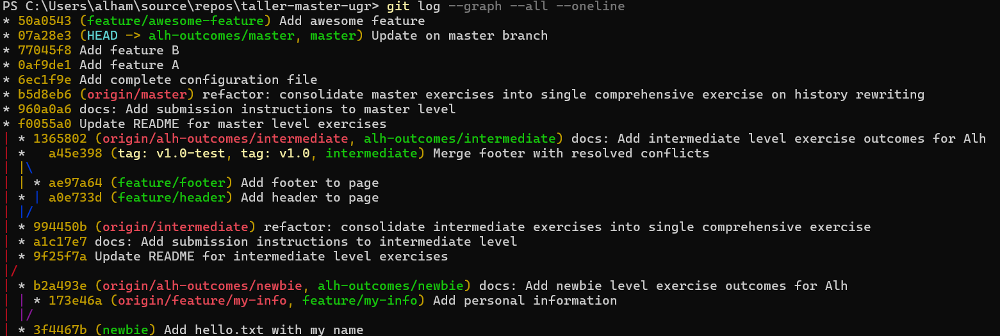
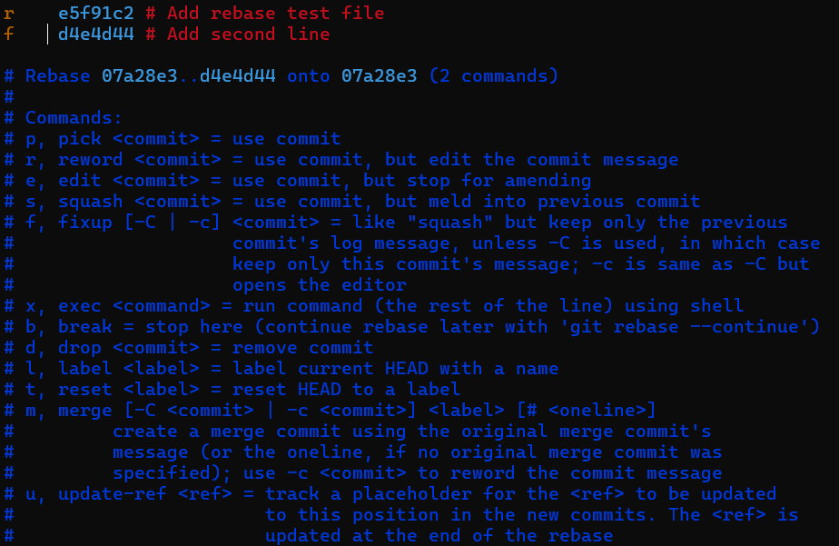
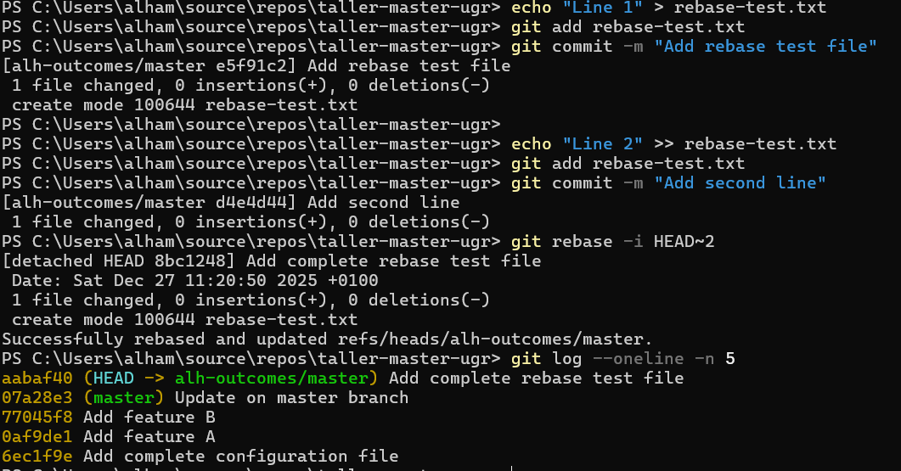

# Exercise Outcomes Submission Template

**Student/Group Name**: Alhambra Espigares 
**Level Completed**: master 
**Date**: 27-12-2025

---

## 📋 Exercise Summary

### Exercise: Master
**Status**: ✅ Completed 

**What I did**:
I completed all parts of the exercise focused on rewriting Git history. I practiced amending commits to correct mistakes without creating additional commits, used interactive rebase to clean and reorganize commit history, rebased a feature branch onto an updated master branch to obtain a linear history, and analyzed the risks and best practices of history rewriting. The final result is a clean, professional commit history and a solid understanding of when and how to safely use rebase and amend.
**Commands Used**:
```bash
git checkout -b master origin/master
git add <file>
git commit
git commit --amend
git log --oneline
git rebase -i HEAD~3
git checkout -b feature/awesome-feature
git rebase master
git log --graph --oneline --all
git checkout -b alh-outcomes/master
```

**Results/Output**:
```
git log --oneline -n 5
77045f8 (HEAD -> master) Add feature B
0af9de1 Add feature A
6ec1f9e Add complete configuration file
b5d8eb6 (origin/master) refactor: consolidate master exercises into single comprehensive exercise on history rewriting
960a0a6 docs: Add submission instructions to master level

# Rebases

Successfully rebased and updated refs/heads/master.
Successfully rebased and updated refs/heads/feature/awesome-feature.
```

**Screenshots**:
- 
- 
- 

---

## 🎯 Key Learnings

**Main concepts I learned**:
1. How git commit --amend rewrites the last commit and replaces
2. How interactive rebase can clean up commit history using fixup and squash
3. The fundamental difference between rebase (rewriting history) and merge (preserving history)

**Skills I improved**:
- Creating clean and professional Git histories.
- Reading and interpreting commit graphs and SHAs.
- Applying safe workflows when rewriting history.

---

## 🚧 Challenges Faced

### Challenge 1: Rebase
**Problem**: Understanding how fixup affects previous commits during interactive rebase.

**Solution**: I experimented with git rebase -i HEAD~3 and verified the results using git log --oneline to confirm that commits were correctly squashed.


---

### Challenge 2: Risks
**Problem**: Knowing when rewriting history is dangerous.

**Solution**: By comparing commit SHAs before and after rebase/amend, I understood why rewriting shared history can break collaborators' work and learned to use --force-with-lease when needed

---

## 💭 Personal Reflection

**What surprised me**:
I was surprised by how useful `git commit --amend` is.  
I didn't know this command before.  
It is very practical for fixing small mistakes without adding extra commits.

**What I found most difficult**:
Understanding when rewriting history is safe and when it is dangerous.  
Especially knowing when not to use rebase on shared branches.

**What I found most useful**:
Learning to use amend and interactive rebase correctly.  
Keeping a clean and readable commit history.

**How I would apply this in real projects**:
I would use amend for small fixes in local commits.  
I would clean feature branches with rebase before opening pull requests.  

---

## ➕ Master Level Detailed Requirements
### Part 1 - Amending Commits

Initial commit:
  - Commit SHA before amend: 333b20f
  - Message: Add configuration file

After amend:
  - Commit SHA after amend: 6ec1f9e
  - Message: Add complete configuration file

Only one commit exists after the amend, proving that history was rewritten rather than extended.

### Part 2 - Interactive Rebase

Commits before rebase:
  - 0af9de1 Add feature A
  - 755d6f7 Add feature B
  - d3d69e8 Fix typo

Using git rebase -i HEAD~3, the "Fix typo" commit was marked as fixup and squashed into the original feature commit.

Commits after rebase:
  - 77045f8 Add feature B
  - 0af9de1 Add feature A

This resulted in a cleaner and more readable history.

**Additional Interactive Rebase Operations**

To demonstrate interactive rebase capabilities, I created additional commits and performed a rebase using multiple operations, rebase-test:

- pick: to keep the base commit
- reword: to change the commit message to "Add complete rebase test file"
- fixup: to squash a follow-up commit without keeping its message

Before rebase:
- e5f91c2 Add rebase test file
- d4e4d44 Add second line

After rebase:
- aabaf40 Add complete rebase test file

This confirms my understanding of advanced interactive rebase operations and how they affect commit history.


### Part 3 - Rebasing a Feature Branch

A feature branch (feature/awesome-feature) was created and rebased onto an updated master branch.

Final history:
  - 50a0543 (feature/awesome-feature) Add awesome feature
  - 07a28e3 (master) Update on master branch
  - 77045f8 Add feature B

The rebase produced a linear history without merge commits, which is preferable for feature branches before integration.

Difference between reset, revert and rebase:
- git reset: moves HEAD and optionally changes the working directory; can rewrite history.
- git revert: creates a new commit that undoes changes; safe for shared history.
- git rebase: rewrites commit history by replaying commits on top of another base.


### Part 4 - Understanding the Risks

During amend and rebase operations, commit SHAs changed, demonstrating that history was rewritten. Rewriting public or shared history is dangerous because other collaborators may depend on commits that no longer exist.

Best practices:
  - Rewrite history only on private or local branches
  - Never rebase shared branches
  - Prefer git push --force-with-lease over --force

--force-with-lease is safer because it ensures the remote branch has not changed before overwriting it.

## 💭 Personal Reflection (Deep Reflection - 200+ words)

Rewriting Git history is one of the most powerful but also most delicate features of Git. Before this exercise, I was aware of interactive rebase and usually relied on it whenever I needed to clean up commits. However, I did not know about the existence or usefulness of git commit --amend. This exercise helped me understand that amend is often the simplest and most appropriate tool for fixing small mistakes in the last commit, such as forgetting to add a file or missing a line of configuration.

I realized that it is very common to forget small details when committing, especially when working quickly. Knowing that amend allows me to correct these mistakes without creating extra commits is extremely useful, and I will definitely use it regularly in my workflow to keep my commit history clean and meaningful.

At the same time, the exercise made it clear when rewriting history is safe and when it becomes dangerous. Rewriting history is acceptable on local or private branches, where no other developers depend on the commits. However, once commits are pushed to a shared or public branch, rewriting history can cause serious problems. Since Git identifies commits by their SHA, changing history breaks references that others may already be using, leading to conflicts, confusion, or even lost work. For this reason, shared branches such as master or main should never be rewritten.

Finally, I now better understand the fundamental difference between rebase and merge. Rebase creates a linear history by rewriting commits, while merge preserves the full history by creating merge commits. In a professional environment, I would use rebase and amend to prepare clean feature branches before opening a pull request, and rely on merges once the work is shared. This distinction is essential for maintaining a clean and safe collaborative workflow.

---

## 📊 Self-Assessment

Rate your confidence level for each topic (1-5, where 5 is very confident):

| Topic | Confidence (1-5) | Notes |
|-------|------------------|-------|
| Basic Git commands | 5 | Confident |
| Branching & merging |4 | Good understanding|
| Remote operations | 4 | Safe usage|
| Conflict resolution | 4 | Practiced during rebase |
| History rewriting | 4 | Better afetr this practice|
| Git hooks | 2 | Basic |
| Security practices | 3 | Correct force usage |

---

## 🔗 Evidence/Artifacts

**Links to branches/commits**:
- Link to your outcome branch: `https://github.com/alhambrx/taller-master-ugr/tree/alh-outcomes/master`
- Key commits demonstrating your work:
  - 6ec1f9e: Add complete configuration file (amend)
  - 77045f8: Cleaned feature history after rebase
  - 50a0543: Feature branch rebased onto master

**Additional files created** (if any):
- config
- featureA
- featureB
- master-update


---

## ✅ Completion Checklist

Before submitting, ensure you have:
- [x] Completed the exercise for your chosen level (including all parts)
- [x] Documented all commands used with their outputs
- [x] Described challenges and how you resolved them
- [x] Provided a thoughtful reflection on your learning
- [x] Self-assessed your confidence in each topic
- [x] Pushed your outcome branch to the remote repository
- [] Created a Pull Request (if required by your instructor)

---

**Submission Date**: 27-12-2025  
**Ready for Review**: ✅ Yes 
